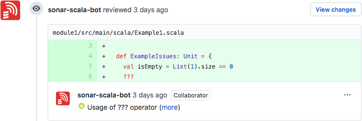
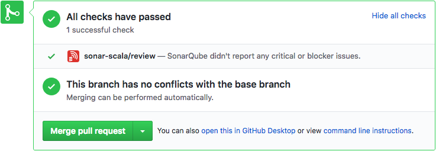

<h1 align="left">  sonar-scala</h1>

[![circleci-badge]][circleci] [![coverage-badge]][coverage]
[![bintray-badge]][bintray] [![bintray-badge-lts]][bintray-lts]
[![bintray-badge-lts-67]][bintray-lts-67]
[![bintray-stats-badge]][bintray-stats] [![gitter-badge]][gitter]

[bintray]: https://bintray.com/mwz/maven/sonar-scala/7.8.0/link
[bintray-badge]: https://img.shields.io/badge/Download-7.8.0-blue.svg
[bintray-badge-lts]:
  https://img.shields.io/badge/Download-7.8.0_(for_SonarQube_7.9_LTS)-blue.svg
[bintray-badge-lts-67]:
  https://img.shields.io/badge/Download-6.8.0_(for_SonarQube_6.7_LTS)-blue.svg
[bintray-lts]: https://bintray.com/mwz/maven/sonar-scala/7.8.0/link
[bintray-lts-67]:
  https://bintray.com/mwz/maven/sonar-scala/6.8.0/link
[bintray-stats]: https://bintray.com/mwz/maven/sonar-scala#statistics
[bintray-stats-badge]:
  https://img.shields.io/badge/dynamic/json.svg?uri=https://bintray.com/statistics/packageStatistics?pkgPath=/mwz/maven/sonar-scala&query=$.totalDownloads&label=Downloads+(last+30+days)&colorB=green
[circleci]: https://circleci.com/gh/mwz/sonar-scala
[circleci-badge]:
  https://img.shields.io/circleci/project/github/mwz/sonar-scala/master.svg?label=Build
[coverage]:
  https://sonar.sonar-scala.com/component_measures?id=sonar-scala&metric=coverage
[coverage-badge]:
  https://sonar.sonar-scala.com/api/badges/measure?key=sonar-scala&metric=coverage
[gitter]: https://gitter.im/sonar-scala/sonar-scala
[gitter-badge]:
  https://img.shields.io/gitter/room/sonar-scala/sonar-scala.svg?colorB=46BC99&label=Chat

**A free and open-source SonarQube plugin for static code analysis of Scala
projects.**

Sonar-scala is an independent SonarQube plugin, driven by and developed with
:heart: by the
[community](https://github.com/mwz/sonar-scala/graphs/contributors).

Intended for [SonarQube 6.7 LTS](https://www.sonarqube.org/sonarqube-6-7-lts),
[SonarQube 7.9 LTS](https://www.sonarqube.org/sonarqube-7-9-lts) and Scala
2.11/2.12.

This plugin uses the [scalariform](https://github.com/scala-ide/scalariform)
library to parse the source code in a version independent way and integrates
with **[Scoverage](http://scoverage.org)** (code coverage),
**[Scalastyle](http://www.scalastyle.org)** and
**[Scapegoat](https://github.com/sksamuel/scapegoat)** (static code analysis).
It also provides [pull request decoration](#pull-request-decoration-new)
functionality, which can review pull requests on Github and make comments on new
issues directly in the pull request instead of reporting them to SonarQube.

_Running analysis from a Windows machine is currently not supported - please use
Linux or other Unix-like operating systems._

<h1>Table of Contents</h1>

- [Supported Metrics](#supported-metrics)
- [Quality Rules and Profiles](#quality-rules-and-profiles)
- [Set-up](#set-up)
- [Sonar-scanner properties](#sonar-scanner-properties)
- [Pull request decoration <sup>NEW!</sup>](#pull-request-decoration-new)
  - [Configuration](#configuration)
  - [Usage](#usage)
- [Compatibility with SonarQube](#compatibility-with-sonarqube)
- [Development](#development)
- [Credits](#credits)
- [Changelog](#changelog)
- [License](#license)

# Supported Metrics

This plugin currently supports the following SonarQube
[metrics](https://docs.sonarqube.org/display/SONAR/Metric+Definitions):

**Size**

- Number of classes (and objects) -
  [`classes`](https://docs.sonarqube.org/display/SONAR/Metric+Definitions#MetricDefinitions-Size)
- Number of lines containing either comments or commented-out code -
  [`comment_lines`](https://docs.sonarqube.org/display/SONAR/Metric+Definitions#MetricDefinitions-Size)
- Number of files (computed by the platform) -
  [`files`](https://docs.sonarqube.org/display/SONAR/Metric+Definitions#MetricDefinitions-Size)
- Lines of code -
  [`ncloc`](https://docs.sonarqube.org/display/SONAR/Metric+Definitions#MetricDefinitions-Size)
- Number of functions -
  [`functions`](https://docs.sonarqube.org/display/SONAR/Metric+Definitions#MetricDefinitions-Size)

**Tests**

- Number of lines of code which could be covered by unit tests -
  [`lines_to_cover`](https://docs.sonarqube.org/display/SONAR/Metric+Definitions#MetricDefinitions-Tests)
- Number of lines of code which are not covered by unit tests -
  [`uncovered_lines`](https://docs.sonarqube.org/display/SONAR/Metric+Definitions#MetricDefinitions-Tests)
- Percentage of line coverage -
  [`line_coverage`](https://docs.sonarqube.org/display/SONAR/Metric+Definitions#MetricDefinitions-Tests)
- Number of unit tests -
  [`tests`](https://docs.sonarqube.org/display/SONAR/Metric+Definitions#MetricDefinitions-Tests)
- Number of skipped unit tests -
  [`skipped_tests`](https://docs.sonarqube.org/display/SONAR/Metric+Definitions#MetricDefinitions-Tests)
- Number of unit test errors -
  [`test_errors`](https://docs.sonarqube.org/display/SONAR/Metric+Definitions#MetricDefinitions-Tests)
- Number of unit test failures -
  [`test_failures`](https://docs.sonarqube.org/display/SONAR/Metric+Definitions#MetricDefinitions-Tests)
- Execution duration of unit tests -
  [`test_execution_time`](https://docs.sonarqube.org/display/SONAR/Metric+Definitions#MetricDefinitions-Tests)

In addition to the above, the plugin reports the following custom metrics, which
are extracted from the Scoverage report:

- Number of all statements -
  [`total_statements`](https://github.com/mwz/sonar-scala/blob/3973e6a8b3857c06de7b6d996702eeb3e543e5e0/src/main/scala/com/mwz/sonar/scala/scoverage/ScoverageMetrics.scala#L64)
- Number of statements covered by tests -
  [`covered_statements`](https://github.com/mwz/sonar-scala/blob/3973e6a8b3857c06de7b6d996702eeb3e543e5e0/src/main/scala/com/mwz/sonar/scala/scoverage/ScoverageMetrics.scala#L74)
- Percentage of statement coverage -
  [`scoverage`](https://github.com/mwz/sonar-scala/blob/3973e6a8b3857c06de7b6d996702eeb3e543e5e0/src/main/scala/com/mwz/sonar/scala/scoverage/ScoverageMetrics.scala#L84)
- Percentage of branch coverage -
  [`branch_scoverage`](https://github.com/mwz/sonar-scala/blob/3973e6a8b3857c06de7b6d996702eeb3e543e5e0/src/main/scala/com/mwz/sonar/scala/scoverage/ScoverageMetrics.scala#L96)

# Quality Rules and Profiles

This plugin integrates 69 quality checks from
[Scalastyle](http://www.scalastyle.org/rules-1.0.0.html) and 118 from
[Scapegoat](https://github.com/sksamuel/scapegoat/tree/v1.3.9). 40 of the
Scalastyle rules are defined without parameters, and the remaining 29 are rule
templates, which allow you to set up custom rules by specifying the parameters
yourself. Most of those are already activated for you with default values
recommended by Scalastyle. Scapegoat rules don't contain any templates.

Sonar-scala creates two rules repositories and four built-in quality profiles:
`Scalastyle`, `Scapegoat` and a combination of those two `Scalastyle+Scapegoat`
and `Recommended by sonar-scala`. The rules in the quality profiles are almost
all activated, except for those which are broken in the upstream projects and
had to be blacklisted.

To make changes to any of the rules, you can clone the quality profile of your
choice and then you should be able to activate or deactivate rules, change rule
severity and create more custom rules from the existing templates.
Alternatively, you can create your quality profile and activate rules from any
of the repositories using SonarQube rule filtering and bulk-change features
available on the Rules page.

For more information about Scalastyle and Scapegoat rules, please consult the
upstream documentation:

- Scalastyle - http://www.scalastyle.org/rules-1.0.0.html
- Scapegoat - https://github.com/sksamuel/scapegoat/tree/v1.3.9

# Set-up

Download the latest [release](https://github.com/mwz/sonar-scala/releases) jar
into your SonarQube plugins folder `/opt/sonarqube/extensions/plugins` and
restart SonarQube either manually or using the update center.

For an out-of-the-box setup, you can use my docker-compose recipe or a docker
image with SonarQube which contains bundled sonar-scala plugin. Please see
[mwz/sonar-scala-docker](https://github.com/mwz/sonar-scala-docker) for more
details.

For automating the analysis of your Scala projects, check out my sbt plugin
[mwz/sbt-sonar](https://github.com/mwz/sbt-sonar).

Also, see the
[examples](https://github.com/mwz/sonar-scala/tree/master/examples) directory,
which includes sample projects for SBT _(`1.x`)_, Gradle _(`5.x`)_ and Maven
_(`3.x`)_ along with basic instructions on how to execute SonarQube analysis for
each of those projects.

# Sonar-scanner properties

The plugin exposes the following properties which can be passed to sonar-scanner
when running an analysis:

- **sonar.sources** - Scala source directory relative to the root of your
  project (usually `src/main/scala`)
- **sonar.tests** (optional) - Scala tests directory relative to the root of
  your project (usually `src/test/scala`)
- **sonar.junit.reportPaths** (optional) - relative path to the directory
  containing unit test execution reports in Surefire XML format (defaults to
  `target/test-reports`); those reports get generated automatically by sbt and
  Gradle (Gradle outputs those in `build/test-results/test`), for Maven see the
  [examples](examples/mvn) on how to configure the
  [Surefire](https://maven.apache.org/surefire/maven-surefire-plugin/test-mojo.html)
  plugin
- **sonar.scala.version** (optional) - defines the version of Scala used in your
  project (requires the `{major}.{minor}` versions and the patch version is
  ignored, defaults to `2.12`)
- **sonar.scala.scoverage.reportPath** (optional) - relative path to the
  scoverage report (defaults to
  `target/scala-${sonar.scala.version}/scoverage-report/scoverage.xml`)
- **sonar.scala.scoverage.disable** (optional) - disables the Scoverage sensor
  from being executed on your sources (defaults to `false`)
- **sonar.scala.scalastyle.disable** (optional) - disables the Scalastyle sensor
  from being executed on your sources (defaults to `false`)
- **sonar.scala.scapegoat.reportPath** (optional) - relative path to the
  scapegoat report (defaults to
  `target/scala-${sonar.scala.version}/scapegoat-report/scapegoat.xml`)
- **sonar.scala.scapegoat.disable** (optional) - disables the Scapegoat sensor
  from being executed on your sources (defaults to `false`)

See an example usage:

```bash
sonar-scanner \
  -Dsonar.host.url=https://your-sonarqube
  -Dsonar.projectName=test \
  -Dsonar.projectKey=test \
  -Dsonar.sources=src/main/scala \
  -Dsonar.tests=src/test/scala \
  -Dsonar.sourceEncoding=UTF-8 \
  -Dsonar.scala.version=2.12 \
  -Dsonar.scoverage.reportPath=target/scala-2.12/scoverage-report/scoverage.xml \
  -Dsonar.scapegoat.reportPath=target/scala-2.12/scapegoat-report/scapegoat.xml
```

or simply run `sbt -Dsonar.host.url=https://your-sonarqube sonarScan` if you use
the [sbt-sonar](https://github.com/mwz/sbt-sonar) sbt plugin.

To run sonar-scala in a debug mode, set the `sonar.verbose` property to `true`,
e.g.

```bash
sbt \
  -Dsonar.host.url=https://your-sonarqube \
  -Dsonar.verbose=true \
  sonarScan
```

# Pull request decoration <sup>NEW!</sup>

Starting from version `7.8.0`, sonar-scala can be run in a decoration mode,
which can analyse Github pull requests and make comments on any new issues
directly on the pull request.

This functionality is similar to what was provided by the
[GitHub Plugin](https://docs.sonarqube.org/display/PLUG/GitHub+Plugin), which
was deprecated in SonarQube 7.2 and replaced by similar functionality in the
paid Developer Edition. :rage: SonarCloud also offers PR analysis, but it
requires a paid subscription for private projects.

**Sonar-scala brings Github PR decoration functionality for free to the
Community Edition of SonarQube!**

See some examples below:




Sonar-scala also reports a status check at the end of the analysis - passed if
no critical or blocker issues are found, or failed otherwise.



## Configuration

- Create a new dedicated Github account, or you can use your existing bot/CI
  account if you already have one.
- Generate a new personal access token for your account. The token can be
  generated in the [developer settings](https://github.com/settings/tokens) on
  Github. Select the `public_repo` scope for public repositories or `repo` for
  private repositories (or a mix of public and private repositories).
- Make sure you give your user write permissions to the repositories you want to
  decorate your PRs for, otherwise sonar-scala will fail as it won't be able to
  set a status of the PR check.

## Usage

Before you execute PR decoration, you need to check out to the latest commit of
the branch which was used to open the pull request. Once you've done that, you
can run sonar-scala in decoration mode by setting the following properties:

- **sonar.scala.pullrequest.provider** - currently, only `github` is supported
- **sonar.scala.pullrequest.number** - number of the pull request; if you use
  CircleCI, you can use the `CIRCLE_PR_NUMBER` env variable, Travis has
  `TRAVIS_PULL_REQUEST`
- **sonar.scala.pullrequest.github.repository** - name of the repository
  including organisation name in the following format `org/project`, e.g.
  `mwz/sonar-scala` or `scala/scala`, etc.
- **sonar.scala.pullrequest.github.oauth** - Github personal access token; can
  be generated in the [developer settings](https://github.com/settings/tokens)
  on Github; select the `public_repo` scope for public repositories or `repo`
  for private repositories (or a mix of public and private repositories)

Optional:

- **sonar.scala.pullrequest.dryrun** - execute PR decoration in "dry run" mode
  (sonar-scala will not post the results to Github). This setting is useful for
  testing purposes in combination with `sonar.verbose=true`. You usually won't
  need to use this setting, unless you run into any issues.

Once you run sonar-scala in decoration mode, instead of sending the results to
SonarQube it will post the relevant comments to Github, which results in
creating an empty project in SonarQube. This is necessary to make this feature
work since the Community Edition of SonarQube doesn't have the support for
branch analysis. Sonar-scala works around that limitation by having an empty
project so that it can still be executed, analyse your code and post any
comments back to Github.

You can create an empty project yourself, or you can let sonar-scala do this for
you. If your SonarQube instance requires authentication to execute an analysis,
you need to make sure that your user has the right permissions to create a new
project and execute an analysis, or just the permission to execute analysis if
you created a new project yourself. Once you created a new blank project, you
can use it across all of your projects.


The following example shows how to run sonar-scala in decoration mode for pull
request [1](https://github.com/mwz/sonar-scala-pr-annotation-example/pull/1) in
the
[mwz/sonar-scala-pr-annotation-example](https://github.com/mwz/sonar-scala-pr-annotation-example)
repository on Github. Notice the project name and key are set to match the
dedicated blank project in SonarQube, which isn't the same project you would
normally use to execute an analysis in a "normal" mode.

```bash
sbt \
  -Dsonar.host.url=http://localhost \
  -Dsonar.projectName='PR Decoration' \
  -Dsonar.projectKey=pr-decoration \
  -Dsonar.scala.pullrequest.provider=github \
  -Dsonar.scala.pullrequest.number=1 \
  -Dsonar.scala.pullrequest.github.repository=mwz/sonar-scala-pr-annotation-example \
  -Dsonar.scala.pullrequest.github.oauth=REDACTED \
  sonarScan
```

If you want to have this automated by your CI, which is ideally how it's
intended to be used, the pull request setting will be different for each pull
request. Most of the modern CI tools allow you to use a built-in environment
variable to get the current pull request number, e.g. CircleCI has
`CIRCLE_PR_NUMBER` and Travis provides `TRAVIS_PULL_REQUEST`.

Please remember that if you use the Scapegoat integration, you still need to
generate scapegoat report before executing sonar-scala by running
`sbt scapegoat` - otherwise any Scapegoat issues in your project won't be
reported back to Github.

# Compatibility with SonarQube

| SonarQube | sonar-scala                                                                                          |
| --------- | ---------------------------------------------------------------------------------------------------- |
| 7.9.x LTS | [7.8.0](https://github.com/mwz/sonar-scala/releases/tag/v7.8.0)                    |
| 6.7.x LTS | 6.x (_latest [6.8.0](https://github.com/mwz/sonar-scala/releases/tag/v6.8.0)_) |

<details>
  <summary>Other versions</summary>
  <table>
    <tr>
      <td><b>SonarQube</b></td>
      <td><b>sonar-scala</b></td>
    </tr>
    <tr>
      <td>7.8</td>
      <td><a href="https://github.com/mwz/sonar-scala/releases/tag/v7.6.0">7.6.0</a></td>
    </tr>
    <tr>
      <td>7.7</td>
      <td><a href="https://github.com/mwz/sonar-scala/releases/tag/v7.5.0">7.5.0</a></td>
    </tr>
    <tr>
      <td>7.6</td>
      <td><a href="https://github.com/mwz/sonar-scala/releases/tag/v7.4.0">7.4.0</a></td>
    </tr>
    <tr>
      <td>7.4</td>
      <td><a href="https://github.com/mwz/sonar-scala/releases/tag/v7.3.1">7.3.1</a></td>
    </tr>
    <tr>
      <td>7.3</td>
      <td><a href="https://github.com/mwz/sonar-scala/releases/tag/v7.0.0">7.0</a></td>
    </tr>
  </table> 
</details>

# Development

To build the project from sources, run the `assembly` task in sbt shell and the
jar assembled with all of the dependencies required by this plugin should be
created in the `target/scala-2.12` directory.

To debug the plugin, export the following environment variable before running
`sonar-scanner` for your project:

```bash
export SONAR_SCANNER_OPTS="-agentlib:jdwp=transport=dt_socket,server=y,suspend=y,address=8000"
```

Once you've done that, `sonar-scanner` should display the following message
`Listening for transport dt_socket at address: 8000`. You can now attach your
IDE to the process on port `8000`, set breakpoints and debug the code.

# Credits

This project is a continuation of the sonar-scala plugin, which was initially
developed by [Sagacify](https://github.com/Sagacify/sonar-scala).

Many other projects have been used as an inspiration, here is a list of the main
ones:

- [RadoBuransky/sonar-scoverage-plugin](https://github.com/RadoBuransky/sonar-scoverage-plugin)
- [arthepsy/sonar-scala-extra](https://github.com/arthepsy/sonar-scala-extra)
- [1and1/sonar-scala](https://github.com/1and1/sonar-scala)
- [SonarSource/sonar-java](https://github.com/SonarSource/sonar-java)
- [SonarSource/sonar-examples](https://github.com/SonarSource/sonar-examples)

# Changelog

For a list of changes and releases, please see [CHANGELOG](CHANGELOG.md).

# License

The project is licensed under the GNU LGPL v3. See the [LICENSE](LICENSE) file
for more details.
